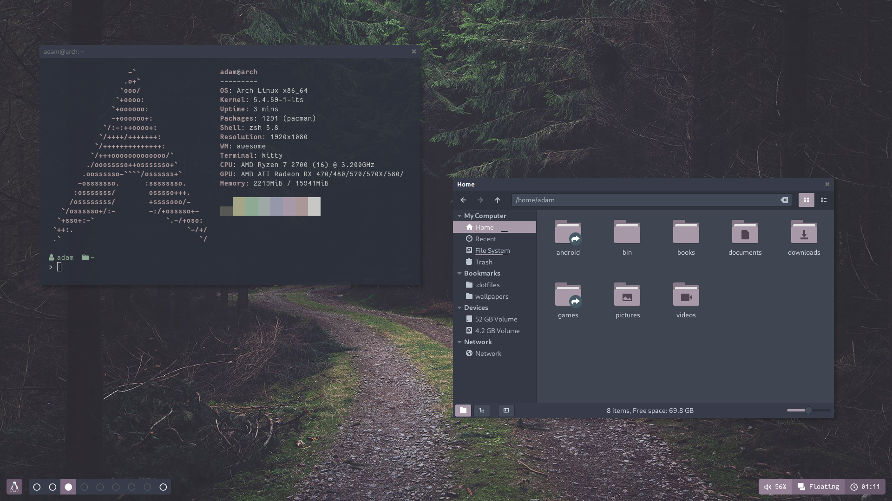

# Dotfiles

My dotfiles for Linux.

## Installation

The dotfiles are managed by [GNU Stow](https://www.gnu.org/software/stow/), so installation and management is simple!

### Download

`git clone https://github.com/adamrutter/dotfiles.git`

### Install a specific configuration

Change to the dotfiles directory, and:

`stow awesome`

## Notes

### Colour scheme

The colour cheme is kept uniform across the desktop, and is very easy to change. [This script](bin/bin/theme.sh) I wrote generates colours using pywal, and takes the accent colour provided by the user and applies it to the window manager, the GTK theme, the icon theme, Rofi, and the terminal.

### Awesome

A lot of effort has been put into seamlessly integrating Awesome into the hot reload flow described above, and it works flawlessly. It listens for custom events emitted from [theme.sh](bin/bin/theme.sh), generates a more complex pallete of tints/shades from Xresources and hot reloads where these colours are used.

For more info on installing my Awesome setup, see the [README in the awesome directory](awesome/.config/awesome/README.md).

My setup was inspired by [adi1090x's polybar-themes](https://github.com/adi1090x/polybar-themes), [elenapan's Awesome setup](https://github.com/elenapan/dotfiles), and [material-awesome](https://github.com/HikariKnight/material-awesome). Go check out their work!

### GTK

A custom variant of [Arc](https://github.com/jnsh/arc-theme) is used. [This script](bin/bin/arc-color-change.sh) I wrote modifies the accent colour in the Arc source files, which can then be built as usual with the changes.
